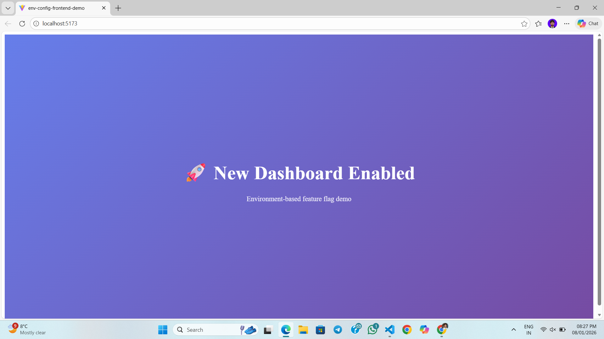

# 12-Factor Frontend Environment Config Demo

A frontend demo project showcasing **12-factor app principles** by managing environment variables for API URLs and feature flags without hardcoding values.

---

## 🚀 Features
- Environment-based configuration (`development` & `production`)
- Centralized config management
- No hardcoded API URLs
- Feature flags for UI toggling
- Safe frontend env exposure
- `.env.example` for easy setup

---

## 🛠️ Tech Stack
- Vite
- React
- TypeScript

---

## ⚙️ Environment Setup

Create environment files at the project root:

### `.env.development`
```env
VITE_API_BASE_URL=https://example.com
VITE_FEATURE_NEW_DASHBOARD=true


.env.production
----

VITE_API_BASE_URL=https://api.example.com
VITE_FEATURE_NEW_DASHBOARD=false


.env.example
----

VITE_API_BASE_URL=
VITE_FEATURE_NEW_DASHBOARD=

⚠️ Only variables prefixed with VITE_ are exposed to the frontend.

🧠 Configuration
----

export const config = {
  apiBaseUrl: import.meta.env.VITE_API_BASE_URL,
  featureNewDashboard:
    import.meta.env.VITE_FEATURE_NEW_DASHBOARD === 'true',
};


🎛️ Feature Flags
---

The dashboard UI toggles automatically based on the environment variable:

true → New Dashboard

false → Old Dashboard

No code changes required.

▶️ Run Locally
----

npm install
npm run dev


## 📸 Output Preview



